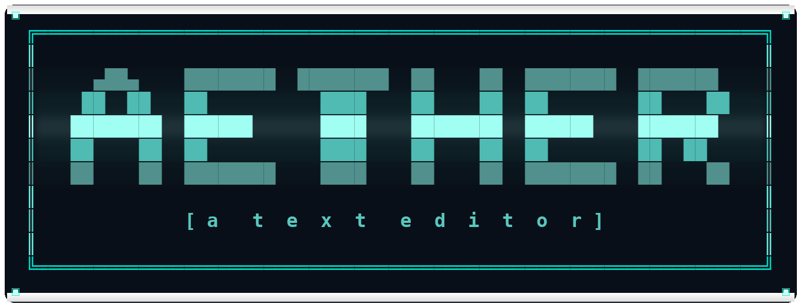

<p align="center">
  <picture>
    <source media="(prefers-color-scheme: dark)" srcset="assets/icons/aether_logo_dark.png">
    <source media="(prefers-color-scheme: light)" srcset="assets/icons/aether_logo_light.png">
    
  </picture>
</p>

<p align="center">
  <strong>A beautiful TUI text editor & IDE — the best of NeoVim and Nano, with modern IDE features.</strong><br/>
  <em>Note: Not to be confused with <a href="https://github.com/omarchy/aether">aether, the theming tool for omarchy</a>.</em>
</p>

<p align="center">
  <a href="#features">Features</a> •
  <a href="#installation">Installation</a> •
  <a href="#usage">Usage</a> •
  <a href="#themes">Themes</a> •
  <a href="#keybindings">Keybindings</a> •
  <a href="#plugins">Plugins</a> •
  <a href="#configuration">Configuration</a>
</p>

---

## Features

- **Three editing modes**: Vim, Nano, and Aether (a smart hybrid)
- **Beautiful TUI** with Textual-quality visuals
- **10 built-in themes** — Aether Dark, Aether Light, Ember, Frost, Midnight, Sakura, Void, Oceanic, Solarized, Dracula
- **Custom themes** via TOML files
- **Syntax highlighting** for 30+ languages (Rust, Python, JS, Go, C/C++, and more)
- **File tree sidebar** with icons and expand/collapse
- **Tab support** for multiple open files
- **Command palette** (Ctrl+P) with fuzzy search
- **Built-in file picker** with directory browsing and filtering
- **Search & replace** (Ctrl+F / /)
- **First-run setup wizard** with onboarding
- **Local AI support** (Ollama integration, no internet needed)
- **Cross-platform** — Linux, macOS, Windows
- **Native binary** — zero runtime dependencies, instant startup
- **Auto-pairs** (brackets, quotes) in Aether mode
- **Smart auto-indent** in Aether mode
- **Recent files** tracking
- **Persistent configuration** saved to `~/.config/aether/`

## Installation

### Linux & macOS

```bash
# Clone the repository
git clone https://github.com/wyind/aether.git
cd aether

# Build and install to ~/.local/bin
make install
```

### Windows

1. **Install Rust**: Download and run the installer from [rustup.rs](https://rustup.rs/).
2. **Clone & Build**:
   ```powershell
   git clone https://github.com/wyind/aether.git
   cd aether
   make install
   ```
   This will build the binary, move it to `~/.local/bin`, and create a Start Menu shortcut automatically.

### Requirements

- [Rust](https://rustup.rs/) 1.70 or later

## Usage

```bash
# Open Aether (shows welcome screen)
aether

# Open a file
aether main.rs

# Open multiple files
aether src/*.rs

# Re-run setup wizard
aether --setup

# Start with a specific theme
aether --theme Ember

# Start with a specific mode
aether --mode vim

# Show help
aether --help
```

## Themes

Aether ships with **10 beautiful built-in themes**:

| Theme | Style | Accent Color |
|---|---|---|
| **Aether Dark** | Deep dark with teal glow | `#00FFD2` |
| **Aether Light** | Clean, bright, professional | `#00AFA0` |
| **Ember** | Warm Catppuccin-inspired | `#f38ba8` |
| **Frost** | Cool Nord blues | `#88c0d0` |
| **Midnight** | GitHub Dark-inspired | `#f0883e` |
| **Sakura** | Soft Japanese pink/purple | `#ff91af` |
| **Void** | Ultra-dark with electric purple | `#9b64ff` |
| **Oceanic** | Deep sea blues and greens | `#50c8dc` |
| **Solarized** | Classic Solarized Dark | `#268bd2` |
| **Dracula** | The beloved dark theme | `#bd93f9` |

### Custom Themes

Aether support full theme customization via TOML. See the [**Theming Guide**](docs/theming.md) for a complete list of fields and examples.

Create a `.toml` file in `~/.config/aether/themes/`:

```toml
name = "My Theme"
bg = "#1a1b26"
fg = "#c0caf5"
accent = "#7aa2f7"

# Optional overrides (auto-generated if omitted)
keyword = "#bb9af7"
string = "#9ece6a"
comment = "#565f89"
function = "#7dcfff"
```

## Keybindings

### Global (all modes)

| Key | Action |
|---|---|
| `Ctrl+P` | Command palette |
| `Ctrl+S` | Save file |
| `Ctrl+O` | Open file (file picker) |
| `Ctrl+N` | New file |
| `Ctrl+W` | Close tab |
| `Ctrl+Q` | Quit |
| `Ctrl+T` | Toggle file tree |
| `Ctrl+F` | Find / Search |
| `Ctrl+Tab` | Next tab |
| `F5` | Cycle theme |

### Vim Mode

| Key | Action |
|---|---|
| `i/a/o` | Enter insert mode |
| `Esc` | Return to normal mode |
| `h/j/k/l` | Movement |
| `w/b` | Word forward/backward |
| `dd` | Delete line |
| `u` | Undo |
| `/` | Search |
| `:w` | Save |
| `:q` | Quit |
| `:wq` | Save and quit |
| `:e <file>` | Open file |

### Nano Mode

Direct typing — just start writing! All shortcuts use `Ctrl+`.

### Aether Mode (recommended)

Direct typing with smart shortcuts:

| Key | Action |
|---|---|
| `Alt+h/j/k/l` | Fast navigation (vim-style without modes) |
| `Alt+w/b` | Word jump forward/backward |
| `Alt+d` | Delete line |
| `Alt+u` | Undo |
| Auto-indent | New lines match previous indentation |

## Plugins

Aether features a powerful Lua plugin system for extending the editor.

- **Location**: `~/.config/aether/plugins/`
- **Hooks**: `on_keypress`, `on_save`, `on_open`
- **API**: Access the editor state via the global `aether` table.

Check out the [**Plugin Guide**](docs/plugins.md) for the full API reference and examples.

## Configuration

Configuration is stored at `~/.config/aether/config.toml` and persists between sessions:

```toml
username = "your_name"
theme_index = 0
edit_mode = "aether"
ai_enabled = false
show_line_numbers = true
tab_size = 4
```

All settings — theme, mode, username, AI preference — are saved automatically when changed via the setup wizard, command palette, or keybindings.

### Desktop Integration

Aether automatically integrates with your desktop environment when installed via `make install`:

- **Linux**: Creates a `.desktop` file in `~/.local/share/applications` and installs a 256x256 icon.
- **macOS**: Creates a `.app` bundle in `~/Applications` with the Aether icon.
- **Windows**: Adds a shortcut to your Start Menu pointing to the installed binary.

You can find these assets in the [`assets/`](assets/) directory:

- [`aether.desktop`](assets/aether.desktop) (Linux)
- [`Info.plist`](assets/Info.plist) (macOS)
- [`aether.ico`](aether%20logos/aether.ico) (Windows)

### Customizing Icons

If you want to use a different icon (e.g., the light theme version), replace the icon in the respective platform's resource folder or update the `assets/` files before running `make install`.

## Local AI Support

Aether supports local AI models via [Ollama](https://ollama.ai):

```bash
# Install Ollama
curl -fsSL https://ollama.ai/install.sh | sh

# Pull a model
ollama pull codellama

# Enable AI in Aether setup
aether --setup
```

AI runs entirely on your machine. No data leaves your computer.

## License

MIT License — see [LICENSE](LICENSE) for details.

## Contributing

Contributions are welcome! Please open an issue or pull request.

---

<p align="center">
  Made with Rust & <3 by <a href="https://github.com/wyind">wyind</a>
</p>
